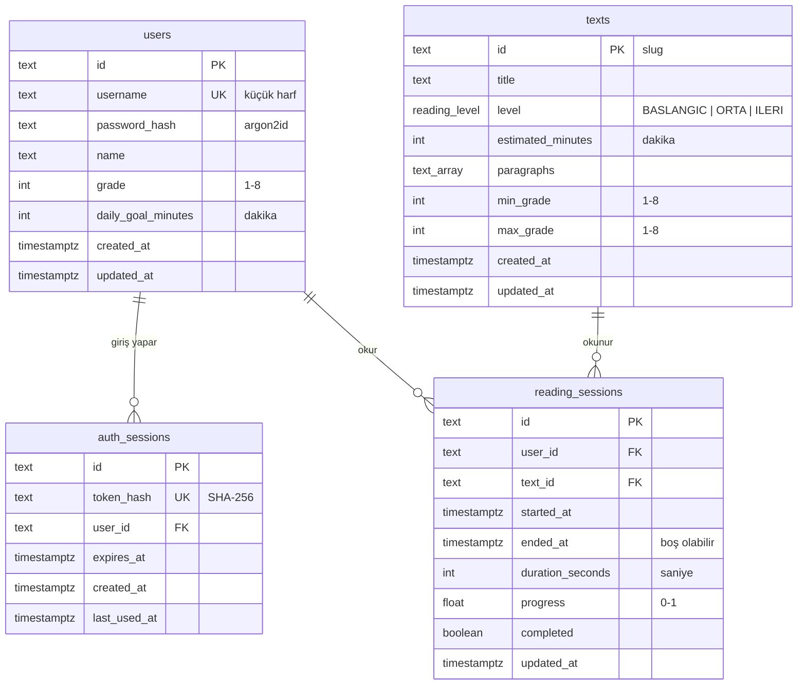

# Veritabanı

Okumatik backend'i PostgreSQL kullanır; şema [Prisma](../prisma/schema.prisma) ile tanımlanır ve
[migration](../prisma/migrations/)'larla oluşturulur. Bu belge tabloları, ilişkileri ve rapor
görünümlerini (view) anlatır. Bağlantı bilgileri ve araçlar için kök
[README](../../README.md#veritabanını-görüntüleme)'ye bakın.

Kullanıcılar 7-14 yaş arası çocuklardır; kişisel veri en aza indirilir. E-posta, doğum tarihi,
telefon gibi alanlar bilinçli olarak yoktur.

## Kurallar

- **İsimlendirme:** PostgreSQL'de tablo ve kolon adları `snake_case`, Prisma'da (kodda)
  `camelCase`'tir. Ör. Prisma'daki `ReadingSession.startedAt` → `reading_sessions.started_at`.
- **Index ve kısıt adları** `<tablo>_<kolonlar>_<tür>` biçimindedir: `_pkey` birincil anahtar,
  `_key` tekil (unique) index, `_idx` index, `_fkey` yabancı anahtar, `_check` CHECK kısıtı.
  Ör. `reading_sessions_user_id_started_at_idx`.
- **Zamanlar** `timestamptz(3)` (saat dilimli, milisaniye hassasiyetinde) saklanır. "Gün" hesabı
  (günlük hedef, `v_daily_reading`) Türkiye saatine (`Europe/Istanbul`) göredir.
- **Açıklamalar:** Her tablo ve kolonun Türkçe açıklaması hem `schema.prisma`'da (`///`) hem
  veritabanında (`COMMENT ON`) vardır; DBeaver/TablePlus'ta "Comment" olarak, psql'de `\d+ users`
  ile görünür.
- **Kimlikler:** Kullanıcı ve oturum kimlikleri `cuid` (ör. `cmg8x1k2p0000abcd1234efgh`),
  metin kimlikleri okunabilir slug'dır (ör. `minik-serce`). Seed'in oluşturduğu örnek okuma
  kayıtlarının kimliği `seed-<kullanıcı>-NN` biçimindedir.

## İlişkiler



- Bir kullanıcının birden çok **giriş oturumu** (farklı cihazlar) ve birden çok **okuma kaydı**
  olabilir.
- Bir metin birçok kez okunabilir; her açılış yeni bir `reading_sessions` satırıdır.
- Tüm yabancı anahtarlar `ON DELETE CASCADE`'dir: kullanıcı silinince oturumları ve okumaları,
  metin silinince o metnin okumaları da silinir.

## Tablolar

### `users` — öğrenciler

| Kolon                | Açıklama                                                              |
| -------------------- | --------------------------------------------------------------------- |
| `username`           | Giriş adı, tekil; her zaman küçük harf (ör. `ayse.k`)                 |
| `password_hash`      | Şifrenin argon2id hash'i; şifrenin kendisi saklanmaz                  |
| `name`               | Ekranda gösterilen ad (ör. `Ayşe`)                                    |
| `grade`              | Sınıf, 1-8. Kullanıcıya hangi metinlerin listeleneceğini belirler     |
| `daily_goal_minutes` | Günlük okuma hedefi (dakika), varsayılan 10                           |
| `updated_at`         | Son güncellenme; Prisma doldurur (SQL ile yapılan değişiklikte değil) |

Kısıtlar: `users_grade_range_check` (1-8), `users_daily_goal_minutes_positive_check` (> 0),
`users_username_lowercase_check` (küçük harf).

### `auth_sessions` — giriş oturumları

Kullanıcı giriş yaptığında oluşur, çıkışta veya süresi dolunca silinir. **Okuma oturumu
değildir.** İstemciye giden token saklanmaz; yalnızca SHA-256 hash'i (`token_hash`) tutulur,
yani veritabanını gören biri token'ı kullanamaz.

| Kolon          | Açıklama                                                          |
| -------------- | ----------------------------------------------------------------- |
| `token_hash`   | Token'ın SHA-256 hash'i (64 karakter hex), tekil                  |
| `user_id`      | Oturumun sahibi (`users.id`)                                      |
| `expires_at`   | Geçerlilik sonu; oturum kullanıldıkça 30 gün ileri kayar          |
| `last_used_at` | Son kullanım (her istekte değil, en fazla 5 dakikada bir yazılır) |

`last_used_at` her kullanımda güncellendiği için bu tabloda ayrıca `updated_at` yoktur.

### `texts` — okuma metinleri

| Kolon                     | Açıklama                                                                            |
| ------------------------- | ----------------------------------------------------------------------------------- |
| `id`                      | Okunabilir slug (ör. `minik-serce`)                                                 |
| `level`                   | `reading_level` enum'u: `BASLANGIC`, `ORTA`, `ILERI`                                |
| `estimated_minutes`       | Tahmini okuma süresi (dakika)                                                       |
| `paragraphs`              | Paragraflar, sırasıyla (`text[]`)                                                   |
| `min_grade` / `max_grade` | Metnin uygun olduğu sınıf aralığı; kullanıcının `grade`'i bu aralıktaysa listelenir |

API seviyeyi sayı olarak döner (`BASLANGIC`=1, `ORTA`=2, `ILERI`=3). Dönüşüm yalnızca
[`src/lib/reading-level.ts`](../src/lib/reading-level.ts)'te yapılır. Enum değerlerinin sırası
seviye sırasıdır; `ORDER BY level` kolaydan zora sıralar.

Kısıtlar: `texts_estimated_minutes_positive_check` (> 0), `texts_grade_range_check`
(1 ≤ `min_grade` ≤ `max_grade` ≤ 8).

### `reading_sessions` — okuma kayıtları

Kullanıcı bir metni açtığında oluşur (`POST /reading-sessions`); okuma sırasında ilerleme ve
süre güncellenir (`PATCH /reading-sessions/:id`).

| Kolon              | Açıklama                                                                           |
| ------------------ | ---------------------------------------------------------------------------------- |
| `started_at`       | Okumanın başladığı an; günlük hedefte bu anın günü (Türkiye saati) sayılır         |
| `ended_at`         | Son ilerleme kaydının anı; metin açılıp hiç kaydedilmediyse boş                    |
| `duration_seconds` | Toplam okuma süresi (saniye). Sunucu, gerçekte geçen süreden fazlasını kabul etmez |
| `progress`         | 0-1 arası oran (0.6 = %60). Geri gitmez; `completed` ise 1'dir                     |
| `completed`        | Metin sonuna kadar okundu mu; bir kez `true` olunca geri dönmez                    |

Kısıtlar: `reading_sessions_progress_range_check` (0-1),
`reading_sessions_duration_seconds_non_negative_check` (≥ 0). Index:
`reading_sessions_user_id_started_at_idx` (kullanıcının günlük toplamı ve son okumaları için).

## Rapor görünümleri (view)

Salt-okunur, SQL araçlarından hızlı bakış içindir; uygulama kullanmaz. Şifre ve token hash'leri
hiçbir görünümde yoktur. Zaman kolonları **Türkiye saatiyle**, saniyeye yuvarlanmış olarak
gösterilir.

### `v_user_summary` — kullanıcı özeti

Her kullanıcı için bir satır (hiç okumamış olanlar dahil).

| Kolon                       | Açıklama                                |
| --------------------------- | --------------------------------------- |
| `username`, `name`, `grade` | Kullanıcı bilgileri                     |
| `total_reading_minutes`     | Toplam okuma süresi (dakika, 1 ondalık) |
| `completed_text_count`      | Sonuna kadar okunan farklı metin sayısı |
| `last_read_at`              | Son okuma zamanı; hiç okumadıysa boş    |

### `v_daily_reading` — günlük okuma

Kullanıcı başına, okuma yapılan her gün için bir satır (okuma yapılmayan günler listelenmez).

| Kolon                | Açıklama                                                          |
| -------------------- | ----------------------------------------------------------------- |
| `reading_date`       | Gün (Türkiye saatine göre, okumanın başladığı gün)                |
| `read_minutes`       | O gün okunan tam dakika; uygulamadaki günlük hedef ile aynı hesap |
| `daily_goal_minutes` | Kullanıcının **şu anki** hedefi (geçmiş hedefler saklanmaz)       |
| `goal_reached`       | `read_minutes >= daily_goal_minutes`                              |

### `v_reading_history` — okuma geçmişi

Her okuma kaydı için bir satır, en yeniden eskiye.

| Kolon                    | Açıklama                         |
| ------------------------ | -------------------------------- |
| `username`, `text_title` | Kim, hangi metni                 |
| `level_name`             | `Başlangıç`, `Orta` veya `İleri` |
| `started_at`, `ended_at` | Başlangıç ve son kayıt zamanı    |
| `duration_minutes`       | Süre (dakika, 1 ondalık)         |
| `progress_percent`       | İlerleme (%, 0-100)              |
| `completed`              | Bitirildi mi                     |

Örnek sorgular:

```sql
-- Bu hafta hedefine en çok ulaşan kullanıcılar
SELECT username, count(*) FILTER (WHERE goal_reached) AS hedef_gunu
FROM v_daily_reading
WHERE reading_date >= (now() AT TIME ZONE 'Europe/Istanbul')::date - 6
GROUP BY username
ORDER BY hedef_gunu DESC;

-- Yarım bırakılan okumalar
SELECT * FROM v_reading_history WHERE NOT completed;
```

## Saat dilimi

Prisma'nın PostgreSQL adapter'ı (`@prisma/adapter-pg`) tarihleri saat dilimi belirtmeden UTC
olarak yazar ve okurken `timestamptz` ofsetini yok sayar. Bu yüzden uygulamanın veritabanı
oturumu her zaman UTC olmalıdır; [`src/db.ts`](../src/db.ts) bunu bağlantı seçeneğiyle
(`-c TimeZone=UTC`) garanti eder ve bir test bunu doğrular.

- Veritabanının varsayılan saat dilimini (`ALTER DATABASE ... SET timezone`) değiştirmeyin;
  Prisma CLI ve Studio gibi araçlar bu ayarı kullanır ve zamanları kaydırarak gösterir.
- SQL aracında Türkiye saatiyle görmek için yalnızca kendi oturumunuzda
  `SET TIME ZONE 'Europe/Istanbul';` çalıştırın ya da görünümleri kullanın.

## Şemayı değiştirirken

1. `prisma/schema.prisma`'yı düzenleyin (yeni alanlara `@map("snake_case")` ve `///` açıklaması
   ekleyin; zamanlar için `@db.Timestamptz(3)`).
2. `npx prisma migrate dev --create-only --name <ad>` ile migration'ı oluşturun ve SQL'i
   **uygulamadan önce** okuyun. Prisma yeniden adlandırmayı DROP + ADD olarak üretir (veri
   kaybı); `ALTER TABLE ... RENAME` ile elle düzeltin.
3. Aynı migration'a yeni kolonların `COMMENT ON COLUMN` satırlarını ekleyin. Prisma
   açıklamaları, CHECK kısıtlarını ve görünümleri yönetmez; bunlar yalnızca migration SQL'indedir.
4. Görünümü değiştirmek için yeni bir migration'da `CREATE OR REPLACE VIEW` (kolon
   kaldırılacaksa `DROP VIEW` + `CREATE VIEW`) kullanın.
5. `npm run db:migrate` ile uygulayın; `npm test` görünümlerin ve açıklamaların varlığını da
   kontrol eder.
